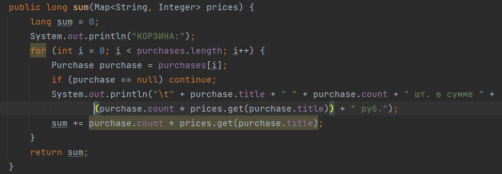

Класс Purchase
1. Указание размера массива при инициализации. Для ухода от этого надо передавать
   мапу товаров и цен в конструктор.

Объявим массив в поле без инициализации.

2. Передавать мапу в этот метод is redundant. Наименование товара есть в массиве purchases.

Просто оставим метод без параметров.

3. Пустой конструктор заменим на конструктор, принимающий мапу списка товаров и в нем будем 
инициализировать массив товаров и цен.
Вариант передавать мапу в первый конструктор повлечет поломку кода дальше в методе addPurchase.
4. Но вообще мне для таких задач коллекции видятся более подходящим вариантом, чем массивы.
5. В идеале наверное логично было бы объект покупки сделать отдельным классом, но для данной 
задачи, пожалуй, это is redundant. К тому же тогда и в Main пришлось бы часть кода переписывать.

Класс Main просто изменим под новую структуру класса Purchase.