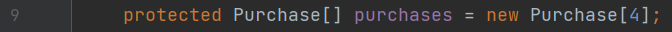
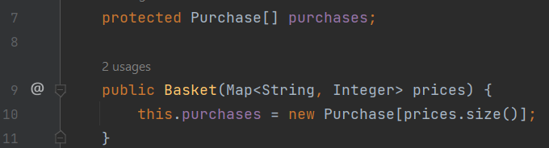

Замечания.
1. Класс Purchase нарушает принцип единственной ответственности (single responsiblity principle), являясь одновременно покупкой и корзиной. 
   Необходимо разделить их на два класса.
2. Указание размера массива при инициализации. Для ухода от этого надо передавать
     мапу товаров и цен в конструктор.
   

Объявим массив в поле без инициализации, инициализируем в конструкторе.

   

Класс Main изменим с учетом разделения класса Purchase на Purchase и Basket.